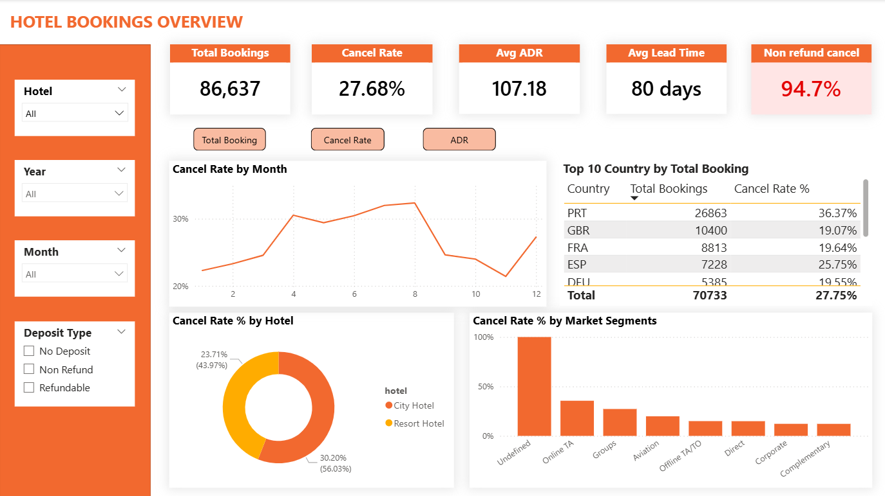
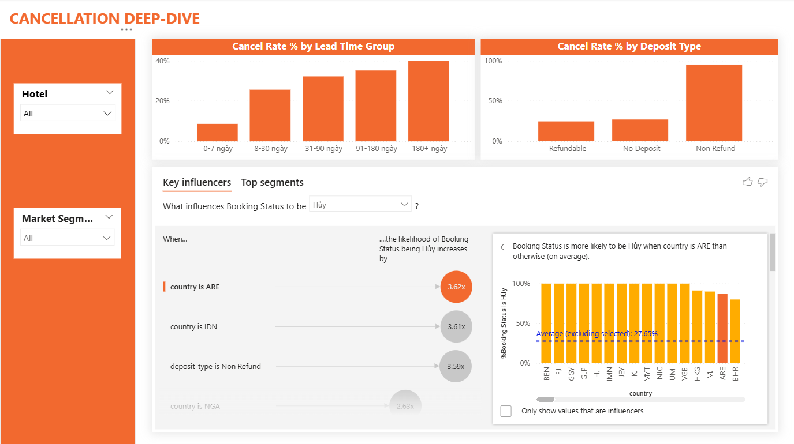
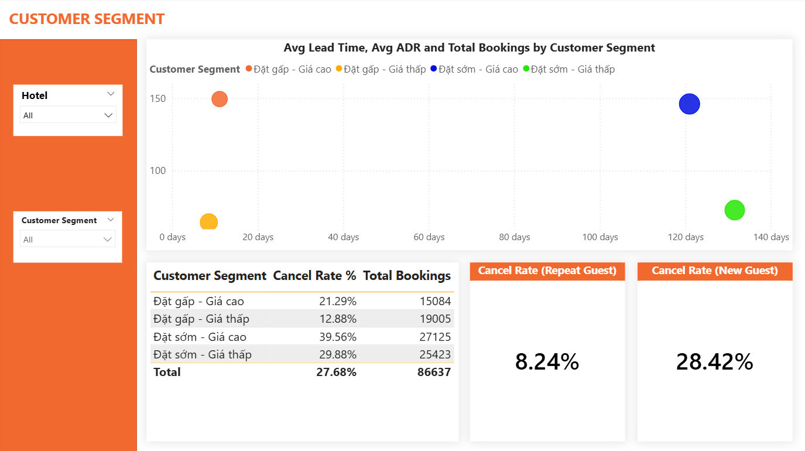
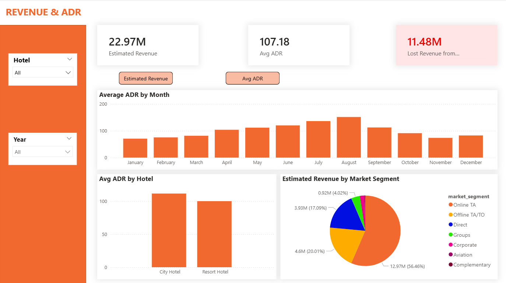

# Hotel Booking Cancellation Analysis

**Language:** English · [Tiếng Việt](README.vi.md)

> A **SQL Server + Power BI** data analytics project exploring which booking characteristics are associated with higher cancellation rates: hotel type, seasonality, lead time, channel and market segment, country, deposit type and repeat guests.

## Contents

- [Overview](#overview)
- [Data](#data)
- [Key Findings](#key-findings)
- [Data Cleaning Workflow](#data-cleaning-workflow)
- [Analysis Approach](#analysis-approach)
- [Power BI Dashboard](#power-bi-dashboard)
- [Repository Structure](#repository-structure)
- [How to Run](#how-to-run)
- [Tools](#tools)
- [Limitations](#limitations)
- [Author](#author)
- [Dashboard Screenshots](#dashboard-screenshots)

## Overview

This is a **Final Data Analytics Project**. SQL Server is used for cleaning and analysis; Power BI is used for data modeling and the dashboard.

**Main questions**

1. What is the overall booking and cancellation profile?
2. How does the cancellation rate differ between City Hotel and Resort Hotel, and across months?
3. Does a longer lead time come with a higher cancellation rate?
4. Which distribution channels and market segments show high cancellation rates?
5. How do deposit type and repeat-guest status relate to cancellations?
6. Do customer segments defined by lead time and ADR behave differently when it comes to cancellations?

> The analysis is **descriptive and association-based**; it does not establish causation.

## Data

- **Source:** the *Hotel Booking Demand* dataset on Kaggle (see also the original paper: Antonio, Almeida & Nunes, 2019, *Data in Brief*). Please check the terms of use on the original page.
- **Scope:** 119,390 bookings, 32 columns, arrival dates from 2015 to 2017, two hotel types (City Hotel, Resort Hotel).
- **After cleaning:** 86,637 bookings.

## Key Findings

| Metric | Result |
|---|---:|
| Bookings after cleaning | 86,637 |
| Cancelled bookings | 23,985 |
| **Overall cancellation rate** | **27.68%** |
| Mean / median ADR | 107.18 / 99.00 |
| Mean / median lead time | 80.3 / 50 days |
| Average length of stay | 3.65 nights |
| Month with the highest cancellation rate | August: 32.36% |
| Market segment with the highest cancellation rate (high volume) | Online TA: 35.55% |
| Lead-time group with the highest cancellation rate | 180+ days: 39.85% (vs 8.51% for 0–7 days) |
| Online TA + 180+ days lead time | 51.86% |
| Repeat guests / new guests | 8.24% / 28.42% |

Full details: [`docs/analysis_en.md`](docs/analysis_en.md) (English) · [`docs/analysis_vi.md`](docs/analysis_vi.md) (Vietnamese).

## Data Cleaning Workflow

Everything is done in SQL Server (see [`sql/hotel_bookings_analysis.sql`](sql/hotel_bookings_analysis.sql)):

1. Back up the original table (`hotel_bookings_raw_backup`).
2. Check row counts, table structure, missing values, duplicates and invalid bookings.
3. Replace the 4 missing `children` values with 0.
4. Keep NULLs in `agent` / `company` because they carry business meaning (direct booking / individual guest).
5. Convert the text `'NULL'` in `agent` / `company` to real NULLs and change the columns to numeric types.
6. Remove invalid bookings, duplicates, zero-night stays and ADR outliers.
7. Create views for Power BI: `vw_hotel_bookings`, `vw_date_dimension`.

| Step | Rows removed | Remaining |
|---|---:|---:|
| Original data | – | 119,390 |
| Bookings with no guests (`adults = children = babies = 0`) | 180 | 119,210 |
| Negative ADR | 1 | 119,209 |
| Duplicate records (identical on all 32 columns) | 31,980 | 87,229 |
| Total nights = 0 | 591 | 86,638 |
| ADR > 1,000 (outlier) | 1 | **86,637** |

## Analysis Approach

**Descriptive analysis**

- Booking count and cancellation rate; mean, median, standard deviation and percentiles of ADR and lead time
- Cancellation rate by hotel type, month, distribution channel, market segment, lead-time group, country, deposit type and repeat-guest status
- ADR and booking count by hotel type; length of stay

**Advanced analysis**

- Pearson correlation: `lead_time` vs `is_canceled` = **0.1835**; `total_nights` vs `is_canceled` = **0.0813** (both positive, weak)
- **Rule-based** customer segmentation by lead time (≤ 30 / > 30 days) and ADR (< 100 / ≥ 100)
- Cross-analysis of market segment × lead-time group

> **Note:** the customer segmentation is **rule-based** with manually chosen thresholds. It is **not** K-means or any other clustering algorithm.

## Power BI Dashboard

The Power BI dashboard (`powerbi/hotel_booking_dashboard.pbix`) is the main interactive output, connected to the two SQL views above.

See [Dashboard Screenshots](#dashboard-screenshots) below for a preview.

## How to Run

1. Import `data/hotel_bookings.csv` into SQL Server as a table named `hotel_bookings`.
2. Run `sql/hotel_bookings_analysis.sql` in order (backup → cleaning → analysis → views).
3. Open the `.pbix` file in Power BI Desktop and point the data source to `vw_hotel_bookings` and `vw_date_dimension`.

## Tools

- **SQL Server**: cleaning, validation, aggregation and analytical queries
- **Power BI**: data modeling, DAX measures, dashboard
- **GitHub**: version control and portfolio presentation

## Limitations

- The analysis identifies associations and trends only; it does not prove causation.
- The dataset has no booking ID, so duplicates were identified on all attributes; some identical rows may be genuinely distinct bookings that were removed.
- July–August contain three years of data (2015–2017) while other months contain two, so month-to-month **booking counts** are skewed (cancellation rate and ADR are less affected).
- Customer segments depend on manually chosen thresholds.
- `Non Refund` has a very high cancellation rate (94.70%) but only 1,037 bookings; interpret it together with volume.
- Country-level analysis is descriptive and does not explain causes.

## Author

**Le Xuan Viet**
Data Analytics | SQL | Power BI

## Dashboard Screenshots

### Overview

### Cancellation 

### Customer Segments

### Revenue & ADR

